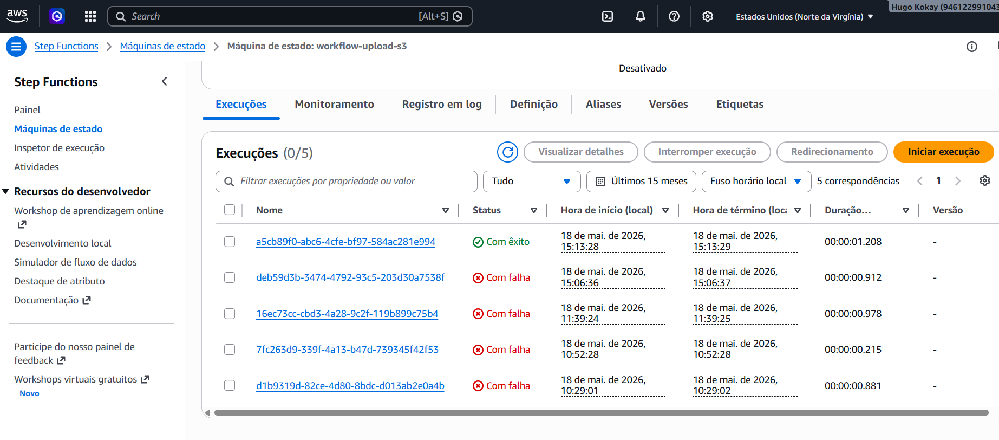
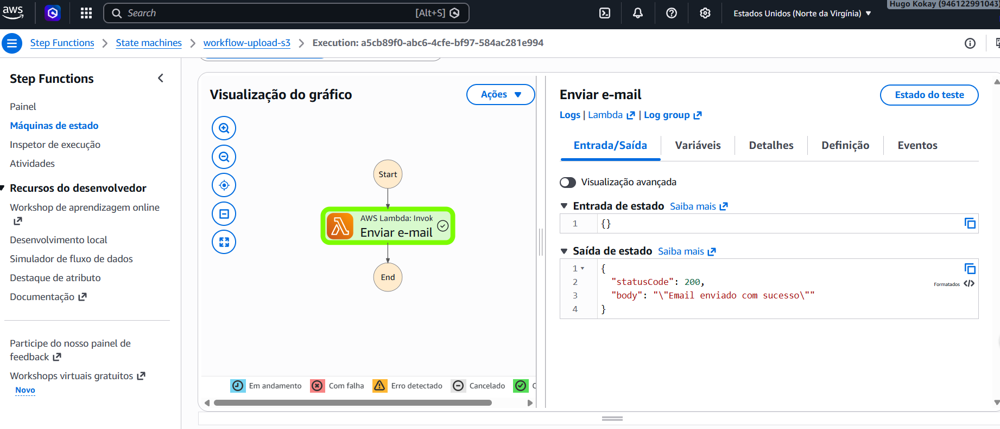
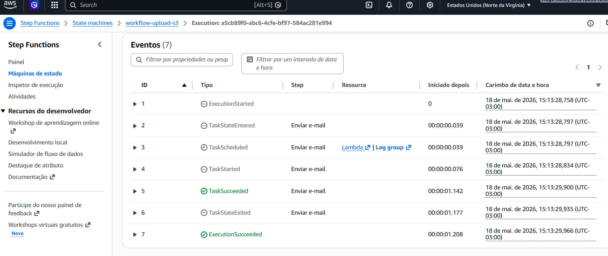
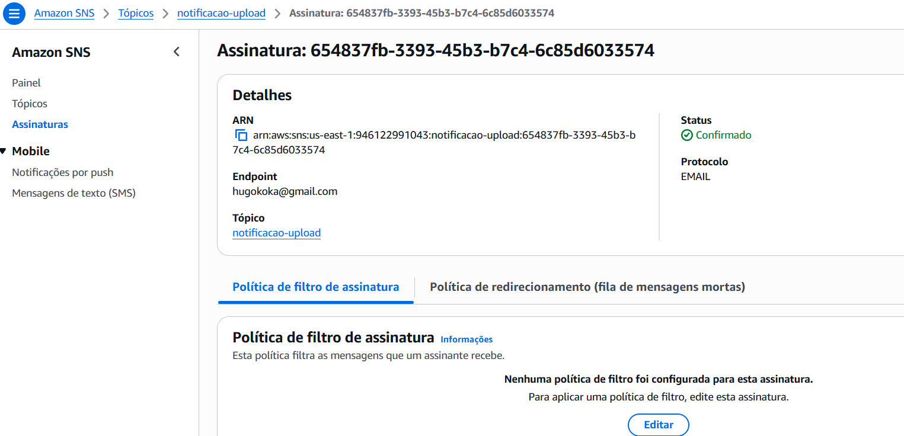
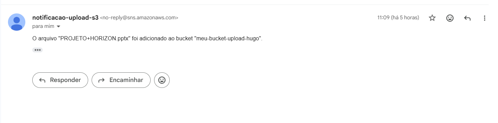
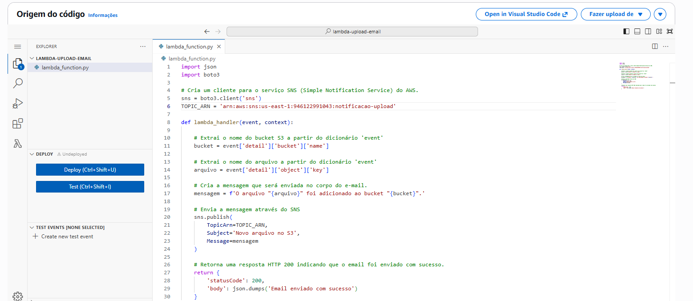

# 📧 Notificador de Upload no S3 com AWS Step Functions e Lambda

Este projeto implementa uma arquitetura **100% Serverless** na AWS que automatiza o envio de notificações por e-mail sempre que um novo objeto (arquivo) é carregado em um bucket Amazon S3.

A orquestração é feita pelo **AWS Step Functions**, que recebe o evento do S3 (via EventBridge), processa os dados e aciona uma **AWS Lambda** (em Python) responsável por formatar e disparar a notificação através do **Amazon SNS**.

---

## 🏗️ Arquitetura do Fluxo

O fluxo de dados funciona da seguinte maneira:

1. **Upload**: Um arquivo é enviado para o Bucket S3.
2. **Evento**: O S3 gera um evento que é capturado pelo Amazon EventBridge.
3. **Orquestração**: O EventBridge aciona a **AWS Step Functions**.
4. **Processamento**: A Step Function repassa o payload do evento para a **AWS Lambda**.
5. **Notificação**: A Lambda extrai o nome do bucket e do arquivo, e publica uma mensagem no **Amazon SNS**, que entrega o e-mail ao destinatário.


## ⚙️ Pré-requisitos

Para implantar este projeto, você precisará de:

- Uma conta AWS ativa.
- AWS CLI instalado e configurado (`aws configure`).
- Um e-mail verificado e confirmado como inscritor (Subscriber) no Tópico SNS.
- Permissões IAM para criar recursos S3, Lambda, Step Functions e SNS.

## 🚀 Passo a Passo da Implantação

### 1. Configurar o Amazon SNS

- Crie um Tópico SNS (ex: `notificacao-upload`).
- Crie uma Inscrição (Subscription) do tipo Email e confirme o link enviado para sua caixa de entrada.
- Anote o ARN do tópico (ex: `arn:aws:sns:us-east-1:946122991043:notificacao-upload`).

### 2. Criar a Função Lambda

- Crie uma função Lambda com o runtime Python 3.x.
- Cole o código contido em `lambda/notifier.py`.
- Nas Variáveis de Ambiente da Lambda, adicione:
  - **Chave**: `SNS_TOPIC_ARN`
  - **Valor**: `arn:aws:sns:us-east-1:946122991043:notificacao-upload`
- Na aba Permissions, adicione uma Inline Policy permitindo a ação `sns:Publish` no ARN do seu tópico.

### 3. Criar a Step Function

- No console do Step Functions, crie uma nova State Machine do tipo Standard.
- Cole a definição JSON contida em `step-functions/state-machine.asl.json`.
- **Importante**: Substitua `"ARN_DA_SUA_LAMBDA_AQUI"` no JSON pelo ARN real da sua função Lambda.
- Na aba Permissions, garanta que a Role da Step Function tenha permissão para `lambda:InvokeFunction`.

### 4. Conectar o S3 ao Fluxo (via EventBridge)

- Crie o Bucket S3 de destino.
- Vá em Properties > Event Notifications > Create event notification.
- Em Event types, marque **All object create events**.
- Em Destination, selecione **EventBridge**.
- No console do EventBridge, crie uma Regra que escute eventos deste bucket e defina a Step Function como alvo (Target).

## 💻 Destaques do Código (Lambda)

O código Python foi desenvolvido seguindo boas práticas:

- Uso do `boto3` para interação nativa com a AWS.
- Extração precisa dos dados do payload do EventBridge: `event['detail']['bucket']['name']` e `event['detail']['object']['key']`.
- Uso de Variáveis de Ambiente para o `TOPIC_ARN`, evitando hardcoding e facilitando a mudança entre ambientes (Dev/Prod).
- Tratamento de exceções (`try/except`) e logs estruturados para fácil depuração no CloudWatch.

### Código Python (lambda/notifier.py)

```python
import json
import boto3

# Cria um cliente para o serviço SNS (Simple Notification Service) do AWS.
sns = boto3.client('sns')
TOPIC_ARN = 'arn:aws:sns:us-east-1:946122991043:notificacao-upload'

def lambda_handler(event, context):

    # Extrai o nome do bucket S3 a partir do dicionário 'event'
    bucket = event['detail']['bucket']['name']

    # Extrai o nome do arquivo a partir do dicionário 'event'
    arquivo = event['detail']['object']['key']

    # Cria a mensagem que será enviada no corpo do e-mail.
    mensagem = f'O arquivo "{arquivo}" foi adicionado ao bucket "{bucket}".'

    # Envia a mensagem através do SNS
    sns.publish(
        TopicArn=TOPIC_ARN,
        Subject='Novo arquivo no S3',
        Message=mensagem
    )

    # Retorna uma resposta HTTP 200 indicando que o email foi enviado com sucesso.
    return {
        'statusCode': 200,
        'body': json.dumps('Email enviado com sucesso')
    }
```

## 📸 Screenshots da Aplicação

Abaixo estão os screenshots que demonstram o funcionamento da arquitetura:

### Configuração de SNS (Subscription)


### Definição da Máquina de Estados


### Eventos da Execução


### Configuração do Tópico SNS


### E-mail Recebido


### Código da Função Lambda


## 🧪 Como Testar

1. Faça o upload de um arquivo de teste (ex: `documento.pdf`) no bucket S3 configurado.
2. Acesse o console do AWS Step Functions e verifique se uma execução foi iniciada e concluída com o status **Succeeded**.
3. Acesse o CloudWatch Logs da função Lambda para confirmar que o evento foi processado.
4. Verifique sua caixa de entrada. Você deve receber um e-mail com o assunto "Novo arquivo no S3" e a mensagem:
   > "O arquivo 'documento.pdf' foi adicionado ao bucket 'nome-do-seu-bucket'."

## 🔒 Segurança e Melhores Práticas

- **Princípio do Menor Privilégio**: As Roles IAM foram configuradas para permitir apenas as ações estritamente necessárias (`s3:GetObject` no bucket específico e `sns:Publish` no tópico específico).
- **Infraestrutura como Código (IaC)**: Para ambientes de produção, recomenda-se provisionar estes recursos utilizando AWS SAM, Terraform ou AWS CDK.
